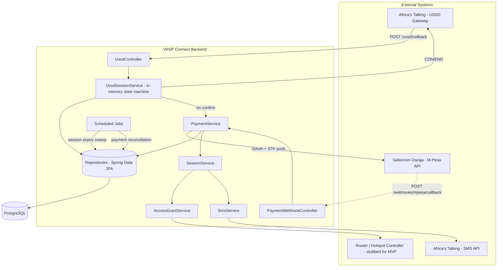

# WISP Connect — High-Level Design (HLD)

## 1. Purpose
This document describes the system architecture for the WISP Connect MVP: a USSD-based, pay-as-you-use internet access platform. It complements the PRD (product intent), the ERD (data model), and the sequence diagrams (interaction flows) already produced for this project.

## 2. Architectural style
A **modular monolith** — a single Spring Boot application, internally organized into clearly separated layers and services, rather than a distributed microservices architecture.

**Why:** at this scale (single access point, single ISP operation, learning-focused MVP), microservices would introduce network latency, deployment complexity, and distributed-transaction problems with no corresponding benefit. A well-structured monolith is faster to build, easier to reason about, and — critically for a portfolio project — easier for a reviewer to actually read end to end. This decision is recorded formally in `adrs/003-modular-monolith.md`.

## 3. Component overview

## 4. Layered structure (within the Spring Boot app)

| Layer | Responsibility | Examples |
|---|---|---|
| **Controller** | Receives external HTTP requests, delegates to services, returns responses. No business logic. | `UssdController`, `PaymentWebhookController` |
| **Service** | Business logic, orchestration, transaction boundaries. | `UssdSessionService`, `PaymentService`, `SessionService`, `AccessGrantService`, `SmsService` |
| **Repository** | Data access, via Spring Data JPA interfaces. | `UserRepository`, `PaymentRepository`, `SessionRepository`, etc. |
| **Entity** | JPA-mapped classes corresponding 1:1 to ERD tables. | `User`, `Package`, `Payment`, `Session`, `WebhookLog`, `SmsLog`, `AccessGrantLog`, `UssdInteractionLog` |

This is the standard three-layer Spring Boot structure — deliberately conventional. Not the place to get creative; consistency here is what makes the codebase readable to any Java developer who opens it.

## 5. External integrations

| System | Direction | Purpose | Notes |
|---|---|---|---|
| Africa's Talking USSD Gateway | Inbound | Delivers user menu interactions | Single callback endpoint; stateful via in-memory session map |
| Safaricom Daraja API | Outbound (request) + Inbound (webhook) | Trigger STK push; receive payment confirmation | Requires OAuth2 client-credentials token, cached and refreshed |
| Africa's Talking SMS API | Outbound | Send session confirmation messages | Logged in `sms_logs` regardless of outcome |
| Router / Hotspot Controller | Outbound | Whitelist device for network access | **Stubbed for MVP** — no real hardware integration; logged as if real via `access_grant_logs` |

## 6. Background jobs (Spring `@Scheduled`)

| Job | Frequency | Purpose |
|---|---|---|
| Session expiry sweep | Every 1 min | Flip `sessions.status` from `ACTIVE` to `EXPIRED` once `end_time` has passed |
| Payment reconciliation | Every 5 min | Detect `Payment.status = SUCCESS` records with no linked `Session`, flag or retry |

## 7. Key design decisions

- **Idempotency key:** `payments.checkout_request_id` (unique constraint) — present on every payment attempt, checked before processing any webhook.
- **Consistency guarantee:** Payment status update + Session creation happen inside a single `@Transactional` boundary, so a partial failure rolls back cleanly rather than leaving orphaned state.
- **Session state (USSD):** kept in-memory only (not persisted) — acceptable for a single-instance MVP; would require a shared store (e.g. Redis) if scaled to multiple backend instances.
- **Primary keys:** UUID across all tables, to avoid exposing sequential, guessable identifiers for payment-related records.

Full reasoning for each of these lives in `/docs/adrs/`.

## 8. Security considerations (MVP scope)

- Webhook endpoint (`/webhooks/mpesa/callback`) restricted to Safaricom's published IP ranges.
- Callback URL treated as a private, unguessable endpoint (not linked publicly).
- No user authentication needed for the USSD flow (identity via MSISDN, per telco).
- Admin-facing endpoints (reporting, manual reconciliation) are out of MVP scope — no auth layer built for them yet.

## 9. Out of scope for MVP

- Real router/RADIUS integration (currently stubbed)
- Multi-access-point support
- Admin dashboard and reporting
- Horizontal scaling / shared session state (Redis)

## 10. Related documents
- `PRD.md`
- `ERD` (dbdiagram.io)
- `/sequence-diagrams/sync-ussd-flow.md`
- `/sequence-diagrams/async-payment-flow.md`
- `/adrs/`