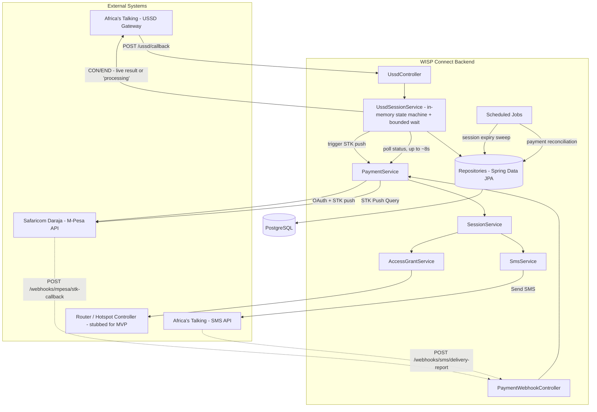

# WISP Connect — High-Level Design (HLD)

*Revision 2 — reflects finalized ERD (UUID PKs, per-step USSD logging), bounded-wait payment pattern, and full API contract.*

## 1. Purpose
This document describes the system architecture for the WISP Connect MVP: a USSD-based, pay-as-you-use internet access platform. It complements the PRD (product intent), the ERD (data model), the API Contract, and the sequence diagrams already produced for this project.

## 2. Architectural style
A **modular monolith** — a single Spring Boot application, internally organized into clearly separated layers and services, rather than a distributed microservices architecture.

**Why:** at this scale (single access point, single ISP operation, learning-focused MVP), microservices would introduce network latency, deployment complexity, and distributed-transaction problems with no corresponding benefit. Recorded formally in `adrs/003-modular-monolith.md`.

## 3. Component overview

```mermaid
flowchart TD
    subgraph External Systems
        UG[Africa's Talking - USSD Gateway]
        MP[Safaricom Daraja - M-Pesa API]
        SMS[Africa's Talking - SMS API]
        RT[Router / Hotspot Controller - stubbed for MVP]
    end

    subgraph WISP Connect Backend
        UC[UssdController]
        USS[UssdSessionService - in-memory state machine + bounded wait]
        PC[PaymentWebhookController]
        PS[PaymentService]
        SS[SessionService]
        AGS[AccessGrantService]
        SMSS[SmsService]
        SCH[Scheduled Jobs]
        REPO[(Repositories - Spring Data JPA)]
    end

    DB[(PostgreSQL)]

    UG -->|POST /ussd/callback| UC
    UC --> USS
    USS --> REPO

    USS -->|trigger STK push| PS
    PS -->|OAuth + STK push| MP
    USS -->|poll status, up to ~8s| PS
    PS -->|STK Push Query| MP
    USS -->|CON/END - live result or 'processing'| UG

    MP -.->|POST /webhooks/mpesa/stk-callback| PC
    PC --> PS
    PS --> SS
    SS --> AGS
    AGS --> RT
    SS --> SMSS
    SMSS -->|Send SMS| SMS
    SMS -.->|POST /webhooks/sms/delivery-report| PC

    SCH -->|session expiry sweep| REPO
    SCH -->|payment reconciliation| REPO

    REPO --> DB
```

## 4. Layered structure

| Layer | Responsibility | Examples |
|---|---|---|
| **Controller** | Receives external HTTP requests, delegates to services, returns responses. No business logic. | `UssdController`, `PaymentWebhookController` |
| **Service** | Business logic, orchestration, transaction boundaries. | `UssdSessionService`, `PaymentService`, `SessionService`, `AccessGrantService`, `SmsService` |
| **Repository** | Data access, via Spring Data JPA interfaces. | `UserRepository`, `PaymentRepository`, `SessionRepository`, etc. |
| **Entity** | JPA-mapped classes, UUID primary keys, matching the finalized ERD. | `User`, `Package`, `Payment`, `Session`, `WebhookLog`, `SmsLog`, `AccessGrantLog`, `UssdInteractionLog` |

## 5. External integrations

| System | Direction | Purpose | Notes |
|---|---|---|---|
| Africa's Talking USSD Gateway | Inbound | Delivers user menu interactions | Single callback endpoint; stateful via in-memory session map |
| Safaricom Daraja — OAuth | Outbound | Access token for all Daraja calls | Cached, refreshed hourly |
| Safaricom Daraja — STK Push | Outbound | Trigger payment prompt | Response only confirms receipt, not payment success |
| Safaricom Daraja — STK Push Query | Outbound | Active status check | Used for the bounded synchronous wait inside `/ussd/callback` |
| Safaricom Daraja — webhook | Inbound | Authoritative payment confirmation | Idempotency-checked via `checkout_request_id` |
| Africa's Talking SMS API | Outbound | Send session confirmation messages | Logged in `sms_logs` regardless of outcome |
| Africa's Talking SMS delivery report | Inbound (optional) | Delivery status | Updates `sms_logs.status` |
| Router / Hotspot Controller | Outbound | Whitelist device for network access | **Stubbed for MVP** — no real hardware integration |

## 6. Background jobs (Spring `@Scheduled`)

| Job | Frequency | Purpose |
|---|---|---|
| Session expiry sweep | Every 1 min | Flip `sessions.status` from `ACTIVE` to `EXPIRED` once `end_time` has passed |
| Payment reconciliation | Every 5 min | Detect `Payment.status = SUCCESS` records with no linked `Session`, flag or retry |

## 7. Key design decisions

- **Idempotency key:** `payments.checkout_request_id` (unique constraint) — checked before processing any webhook.
- **Consistency guarantee:** Payment status update + Session creation happen inside a single `@Transactional` boundary.
- **Bounded synchronous wait:** on payment confirmation, the USSD handler actively polls Daraja's STK Push Query for up to ~8 seconds before responding — real success shown live if the user pays quickly, otherwise the session ends with "processing" and the async webhook flow completes it. Reconciles the live UX (see user flow diagram) with the underlying async architecture.
- **Per-step USSD interaction logging:** `ussd_interaction_logs` stores one row per screen transition (not one summary row per dial-in), grouped by `ussd_session_id`, with nullable `user_id`/`package_id` FKs — enables tracing exactly where a user drops off, not just that they did.
- **USSD session state (routing):** kept in-memory only, separate from the durable `ussd_interaction_logs` audit trail — acceptable for a single-instance MVP; would require a shared store (e.g. Redis) if scaled to multiple backend instances.
- **Primary keys:** UUID across all tables, to avoid exposing sequential, guessable identifiers for payment-related records.

Full reasoning for each lives in `/docs/adrs/`.

## 8. Security considerations (MVP scope)

- Webhook endpoints restricted to known provider IP ranges (Safaricom, Africa's Talking) where feasible.
- Callback URLs treated as private, unguessable endpoints.
- No user authentication needed for the USSD flow (identity via MSISDN, per telco).
- Admin-facing endpoints (reporting, manual reconciliation) are out of MVP scope — no auth layer built for them yet.

## 9. Out of scope for MVP

- Real router/RADIUS integration (currently stubbed)
- Multi-access-point support
- Admin dashboard and reporting
- Horizontal scaling / shared session state (Redis)

## 10. Related documents
- `PRD.md`
- `ERD` (dbdiagram.io)
- `api_contract.md`
- `/sequence-diagrams/sync-ussd-flow.md`
- `/sequence-diagrams/async-payment-flow.md`
- `/adrs/`